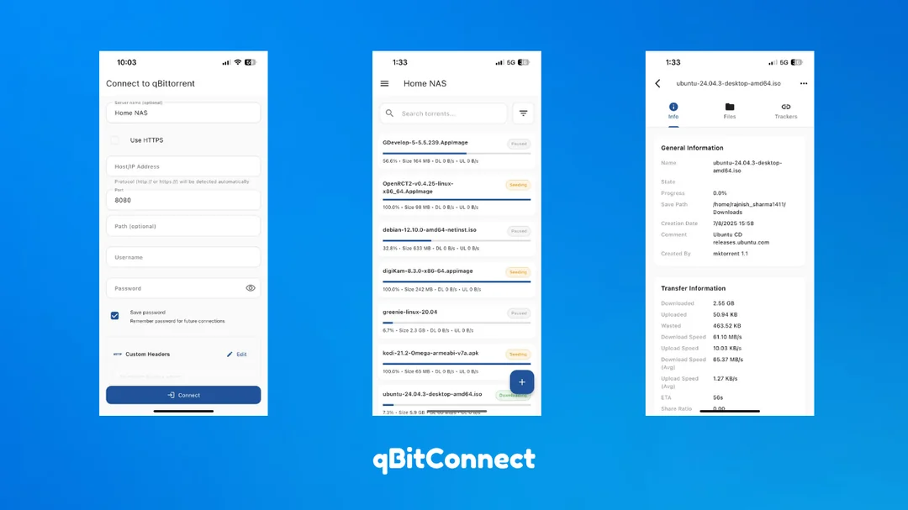

# qBitConnect

A Flutter app for managing qBittorrent remotely.

[](https://flutter.dev/)
[](https://dart.dev/)
[](https://opensource.org/licenses/MIT)
[](https://flutter.dev/)

A modern, cross-platform mobile application for remote qBittorrent management. Connect to your qBittorrent server from anywhere and manage your downloads with ease.

## 📸 Screenshots

<p align="center">
  
</p>

## 📱 Download

<a href="https://play.google.com/store/apps/details?id=com.bluematter.qbitconnect"></a><a href="https://github.com/RajnishOne/qbitconnect/releases"></a>

### iOS - AltStore Installation

<!-- &nbsp;&nbsp;<a href="https://intradeus.github.io/http-protocol-redirector?r=altstore://source?url=https://raw.githubusercontent.com/RajnishOne/qbitconnect-releases/main/altstore-pal.json"></a>&nbsp;&nbsp;&nbsp;&nbsp;<a href="https://intradeus.github.io/http-protocol-redirector?r=altstore://source?url=https://raw.githubusercontent.com/RajnishOne/qbitconnect-releases/main/altstore.json"></a> -->

&nbsp;&nbsp;&nbsp;<a href="https://intradeus.github.io/http-protocol-redirector?r=altstore://source?url=https://raw.githubusercontent.com/RajnishOne/qbitconnect-releases/main/altstore.json"></a>

## 🔗 Quick Links For AltStore

### AltStore Sources
- **For AltStore Classic**: `https://raw.githubusercontent.com/RajnishOne/qbitconnect-releases/main/altstore.json`
<!-- - **For AltStore PAL (EU)**: `https://raw.githubusercontent.com/RajnishOne/qbitconnect-releases/main/altstore-pal.json` -->
- **For AltStore PAL (EU)**: Coming soon

### Installation Instructions

#### How to Install via AltStore

**What is AltStore?**  
AltStore is an alternative app store for iOS that allows you to sideload apps using just your Apple ID. No jailbreak required!

**Installation Steps:**

1. **Install AltStore** on your device
   - Download from [altstore.io](https://altstore.io/)
   - Follow the installation guide for your platform (Windows/Mac)

2. **Add qBitConnect Source** (choose one method)
   - **Option A (Easy):** Click one of the buttons above on your iOS device
   - **Option B (Manual):** 
     - Open AltStore on your iOS device
     - Go to **Browse** → **Sources** → tap **+** (top right)
     - Enter this URL:
       - For AltStore Classic: `https://raw.githubusercontent.com/RajnishOne/qbitconnect-releases/main/altstore.json`
       <!-- - For AltStore PAL (EU): `https://raw.githubusercontent.com/RajnishOne/qbitconnect-releases/main/altstore-pal.json` -->
       - For AltStore PAL (EU): Coming Soon

3. **Install qBitConnect**
   - Find qBitConnect in your added source
   - Tap **GET** to install
   - The app will auto-update through AltStore

**Benefits:**
- ✅ Auto-updates when new versions are released
- ✅ No jailbreak required
- ✅ Works on any iOS device
- ✅ Open source and transparent

## ✨ Features

### 🚀 Core Functionality
- **Complete qBittorrent Integration**: Connect to any qBittorrent Web UI with advanced authentication
- **Real-time Management**: Live torrent monitoring with configurable refresh intervals (1-30 seconds)
- **Multi-format Support**: Add torrents via magnet links, URLs, or direct torrent file uploads
- **Comprehensive Controls**: Full torrent lifecycle management (pause, resume, delete, recheck)

### 🎯 Advanced Torrent Management
- **Batch Operations**: Select and manage multiple torrents simultaneously
- **Smart Filtering**: Filter by status (downloading, seeding, paused, stalled, errored, active, inactive)
- **Category Organization**: Organize torrents with category-based filtering and management
- **Powerful Search**: Real-time search across all torrents with instant results
- **Flexible Sorting**: Sort by name, size, progress, speeds, dates, priority, and more
- **Detailed Statistics**: Comprehensive server and individual torrent statistics

### 📊 Real-time Monitoring
- **Live Updates**: Automatic refresh with customizable polling intervals
- **Transfer Statistics**: Real-time upload/download speeds and data transfer monitoring
- **Connection Status**: Live connection monitoring with automatic reconnection
- **Performance Metrics**: Detailed server performance and resource usage statistics

### 🎨 Premium User Experience
- **Multiple Themes**: Light, Dark, OLED (true black), and System theme variants
- **Responsive Design**: Optimized for phones, tablets, and various screen sizes
- **Smooth Animations**: Polished UI with loading animations and transitions
- **Intuitive Navigation**: Clean, modern interface following Material Design principles

### ⚙️ Advanced Configuration
- **Custom Headers**: Support for proxy authentication and custom HTTP headers
- **Connection Persistence**: Remember multiple server configurations with auto-connect
- **Display Customization**: Configurable torrent card layouts and information display
- **Polling Control**: Fine-tune refresh rates for optimal performance and battery life

### 🔍 Detailed Information Views
- **Torrent Details**: Comprehensive information including files, trackers, and peers
- **File Management**: View and manage individual files within torrents
- **Tracker Monitoring**: Real-time tracker status and performance data
- **Transfer History**: Track download/upload progress and statistics over time

### 🔒 Privacy & Security
- **Secure Storage**: Encrypted credential storage with biometric protection support
- **Privacy-First Analytics**: Optional, configurable analytics with no personal data collection
- **No Data Tracking**: Zero collection of torrent content, personal information, or server details
- **Custom Authentication**: Support for various authentication methods and proxy configurations

### 📱 Mobile-Optimized Features
- **Network Handling**: Graceful handling of network changes and connectivity issues
- **Offline Resilience**: Smart caching and error recovery mechanisms
- **Battery Optimization**: Efficient polling and background processing

## Setup Instructions

### Prerequisites

- Flutter SDK (latest stable version)
- Android Studio / Xcode for mobile development
- qBittorrent with Web UI enabled

### Firebase Configuration

This app uses Firebase for analytics and crash reporting. To set up Firebase:

1. Create a new Firebase project at [Firebase Console](https://console.firebase.google.com/)
2. Add Android and iOS apps to your project
3. Download and place your configuration files:
   - Place your `google-services.json` in `android/app/google-services.json`
   - Place your `GoogleService-Info.plist` in `ios/Runner/GoogleService-Info.plist`
   - Update `lib/firebase_options.dart` with your Firebase configuration values

### Analytics Configuration

The app includes basic Firebase Analytics for understanding user behavior. For privacy and open-source considerations:

- **Disable Analytics**: Set `analyticsEnabled = false` in `lib/src/services/analytics_config.dart`
- **Selective Disabling**: You can disable specific features like screen tracking, event tracking, etc.
- **Privacy-Focused**: Analytics are configured to be privacy-friendly and don't collect sensitive user data

The analytics implementation is minimal and focused on:
- Screen views (connection, torrents, settings)
- Basic events (connection success/failure, theme changes, settings changes)
- App usage patterns (app opens)

No personal information, torrent data, or server credentials are tracked.

### Android Keystore Setup

For release builds, you'll need to configure your Android keystore:

1. Create a keystore file (if you don't have one):
   ```bash
   keytool -genkey -v -keystore ~/upload-keystore.jks -keyalg RSA -keysize 2048 -validity 10000 -alias upload
   ```

2. Update `android/key.properties` with your actual values:
   ```properties
   storePassword=YOUR_ACTUAL_STORE_PASSWORD
   keyPassword=YOUR_ACTUAL_KEY_PASSWORD
   keyAlias=YOUR_ACTUAL_KEY_ALIAS
   storeFile=YOUR_ACTUAL_KEYSTORE_FILE_PATH
   ```

### Local Properties

Update `android/local.properties` with your SDK paths:
```properties
sdk.dir=YOUR_ANDROID_SDK_PATH
flutter.sdk=YOUR_FLUTTER_SDK_PATH
```

**Note**: The configuration files in this repository are ignored by git. You need to place your own Firebase configuration files and update the local properties with your actual values.

### Installation

1. Clone the repository
2. Run `flutter pub get` to install dependencies
3. Configure Firebase and keystore as described above
4. Run `flutter run` to start the app

## 📖 Quick Start

### Basic Setup
1. **Launch the app** and navigate to the connection screen
2. **Enter server details**:
   - qBittorrent Web UI URL (e.g., `http://192.168.1.100:8080` or `https://mydomain.com:8080`)
   - Username and password
   - Optional: Server name for easy identification
3. **Connect** and start managing your torrents

### Advanced Configuration
- **Custom Headers**: Configure authentication headers for proxy setups
- **Polling Settings**: Adjust refresh intervals (1-30 seconds) in Settings
- **Theme Selection**: Choose from Light, Dark, OLED, or System themes
- **Display Options**: Customize torrent card information and layout

## Development

### Project Structure

```
lib/
├── src/
│   ├── api/          # qBittorrent API client and services
│   │   ├── client/   # HTTP client configuration
│   │   └── services/ # API endpoint services
│   ├── constants/    # App constants and strings
│   ├── core/         # Core app components (router, initialization)
│   ├── models/       # Data models (Torrent, Statistics, etc.)
│   ├── screens/      # UI screens and views
│   ├── services/     # Business logic services
│   │   ├── firebase_service.dart     # Analytics and crash reporting
│   │   ├── batch_operations_service.dart # Batch torrent operations
│   │   └── prefs.dart               # Shared preferences management
│   ├── state/        # State management (Provider-based)
│   │   ├── app_state_manager.dart   # Main app state
│   │   ├── torrent_state.dart       # Torrent data management
│   │   ├── batch_selection_state.dart # Multi-selection logic
│   │   └── realtime_state.dart      # Real-time updates
│   ├── theme/        # Advanced theming system
│   │   ├── theme_variants.dart      # Multiple theme options
│   │   ├── app_colors.dart          # Color schemes
│   │   └── theme_manager.dart       # Theme persistence
│   ├── utils/        # Utility functions and helpers
│   └── widgets/      # Reusable UI components
│       ├── torrent_card_with_selection.dart
│       ├── batch_actions_bar.dart
│       ├── filter_bottom_sheet.dart
│       └── animated_reload_button.dart
├── firebase_options.dart  # Firebase configuration
└── main.dart              # App entry point
```

### Technical Highlights

#### Architecture
- **State Management**: Provider-based architecture with reactive state management
- **Real-time Updates**: Sophisticated polling system with configurable intervals and debouncing
- **Batch Operations**: Advanced multi-selection system with validation and error handling
- **Theme System**: Multi-variant theming with persistence and system integration
- **Network Layer**: Robust HTTP client with cookie management and error recovery

#### Performance Features
- **Smart Caching**: Efficient caching of torrent data and UI states
- **Debounced Updates**: Prevents excessive API calls during rapid user interactions
- **Background Processing**: Optimized background updates and lifecycle management
- **Memory Management**: Efficient widget caching and cleanup mechanisms

#### User Experience
- **Responsive Design**: Adaptive layouts for various screen sizes and orientations
- **Smooth Animations**: Custom animation system with performance optimization
- **Error Handling**: Comprehensive error handling with user-friendly messages
- **Accessibility**: Screen reader support and accessibility optimizations

### Building for Release

#### Android
```bash
flutter build apk --release
```

#### iOS
```bash
flutter build ios --release
```

## 🤝 Contributing

We welcome contributions! Please feel free to submit a Pull Request. For major changes, please open an issue first to discuss what you would like to change.

### How to Contribute

1. **Fork** the repository
2. **Create** a feature branch (`git checkout -b feature/AmazingFeature`)
3. **Commit** your changes (`git commit -m 'Add some AmazingFeature'`)
4. **Push** to the branch (`git push origin feature/AmazingFeature`)
5. **Open** a Pull Request

### Development Setup

1. Ensure you have Flutter SDK installed
2. Clone your forked repository
3. Run `flutter pub get` to install dependencies
4. Make your changes
5. Run tests: `flutter test`
6. Ensure code follows the project's style guidelines

### Code Style

- Follow Dart/Flutter conventions
- Use meaningful variable and function names
- Add comments for complex logic
- Keep functions small and focused
- Write tests for new features

### Reporting Issues

When reporting issues, please include:
- Device/OS information
- Steps to reproduce
- Expected vs actual behavior
- Screenshots if applicable

## 📄 License

This project is licensed under the MIT License - see the [LICENSE](LICENSE) file for details.

## 🙏 Acknowledgments

- [qBittorrent](https://www.qbittorrent.org/) - The amazing torrent client that makes this possible
- [Flutter](https://flutter.dev/) - The framework that powers this app
- All contributors and users who provide feedback and suggestions

## 🆘 Support

### Common Issues

#### Connection Problems
- Verify qBittorrent Web UI is enabled
- Check firewall settings
- Ensure correct URL format
- Verify username/password

#### Real-time Updates Not Working
- Check network connectivity
- Verify qBittorrent is running
- Check for error messages in logs
- Restart the application

#### Performance Issues
- Reduce polling frequency if needed
- Close unnecessary torrent details pages
- Check device resources
- Update to latest version

### Getting Help

- **Issues**: Create an issue on GitHub
- **Discussions**: Use GitHub Discussions
- **Documentation**: Check this README and code comments
- **Logs**: Enable debug logging for troubleshooting

---

**Last Updated**: September 2025  
**Version**: 1.4.0+13  
**Flutter Version**: 3.35+  
**Dart Version**: 3.9+

---

⭐ **Star this repository if you find it helpful!**
